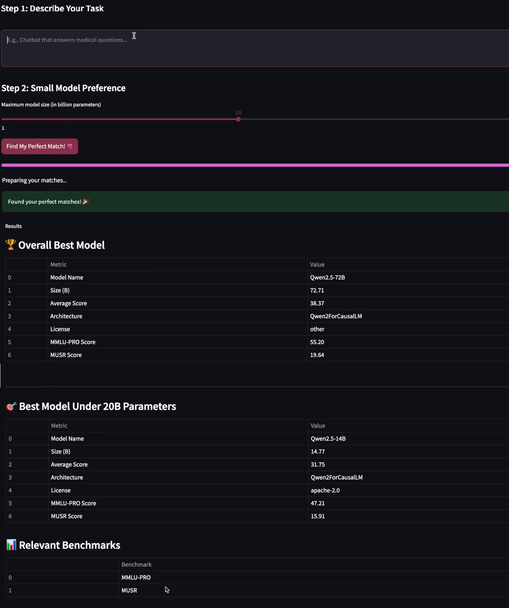

# Perfect LLM Model Finder

🚀 **Live Web App**: [https://best-llm-model-finder-3a5c.vercel.app](https://best-llm-model-finder-3a5c.vercel.app)  
⚙️ **Backend API**: [https://perfect-llm-finder-api.onrender.com](https://perfect-llm-finder-api.onrender.com) (Status: [Health Check](https://perfect-llm-finder-api.onrender.com/api/health))

Perfect LLM Model Finder is a tool designed to simplify the overwhelming process of choosing the right LLM wrt Usecase or Project.



Welcome to **Perfect LLM Model Finder**, where I help you find your ideal Large Language Model (LLM) based on Open LLM Benchmarks! If you're tired of swiping left on models that don't quite meet your needs, this project is here to match you with the perfect partner for your task. 

## What is Perfect LLM Model Finder? 🤔

Perfect LLM Model Finder is a tool designed to simplify the overwhelming process of choosing the right LLM. With so many options out there, making the right choice can feel daunting. I've taken the heavy lifting off your shoulders by integrating Open LLM Benchmarks to analyze and rank models based on their performance for your specific requirements.

It helps you find your perfect open-source LLM match in 2 Simple Steps!
You won't have to use the same model for every task. Use the best open-source model backed by Open LLM Benchmarks for your task! 

Features:
1. **Global Language Support**: Compatible with 100+ languages for worldwide accessibility
2. **Comprehensive Benchmarking**: Leverages 6 different LLM benchmarks for accurate matching
3. **Real-time Updates**: Benchmark data refreshes every 2 hours for up-to-date recommendations
4. **Quality Assured**: Only suggests official, non-flagged models you can trust

Just describe your task and set your size preference - it'll handle the rest!

## Features 🎯

- **Performance-Driven Matching:** Compare LLMs using benchmark data and find the one that performs best for your task.
- **Interactive Interface:** Powered by Streamlit, the app makes it super easy and intuitive to use.
- **Customizable:** Configure your preferences to find the model that suits you best.


## Getting Started 🚀

Follow these steps to set up and start your journey to finding the perfect LLM:

### 1. Clone the Repository
First, clone this repo to your local machine:

```bash
git clone https://github.com/GURPREETKAURJETHRA/Perfect-LLM-Model-Finder.git
cd Perfect-LLM-Model-Finder
```

### 2. Install Dependencies
You'll need to install the required Python packages. Run the following command:

```bash
pip install -r requirements.txt
```

### 3. Google Cloud Service Account Key 🔑
To access the benchmark data, you'll need a **Google Cloud Service Account Key**. Here's how to get it:

1. Log in to your Google Cloud Console.
2. Navigate to the **IAM & Admin** section and create a new service account if you don't already have one.
3. Assign the required roles (e.g., `Storage Object Viewer` for accessing the benchmark data).
4. Generate a JSON key for the service account.
5. Save the key in your project directory and name it `service_account_key.json`.

> **Note:** Keep this key secure. Do not share or upload it to public repositories.

### 4. Run the App
You're ready to find your LLM soulmate! Launch the app with the following command:

```bash
streamlit run app.py
```

## How It Works 🛠️

1. **Input Your Requirements:** Select the type of task you're working on (e.g., text generation, summarization, Q&A).
2. **Model Benchmarking:** The app pulls data from Open LLM Benchmarks to compare the performance of different models.
3. **Find Your Match:** Get recommendations for the best model(s) tailored to your needs.

## Why Model Matrimony? 🌟

- **Time Saver:** Stop spending hours researching and testing models.
- **Data-Driven Decisions:** Recommendations are based on reliable benchmark data, not guesswork.
- **User-Friendly:** The Streamlit interface ensures a smooth and interactive experience.

